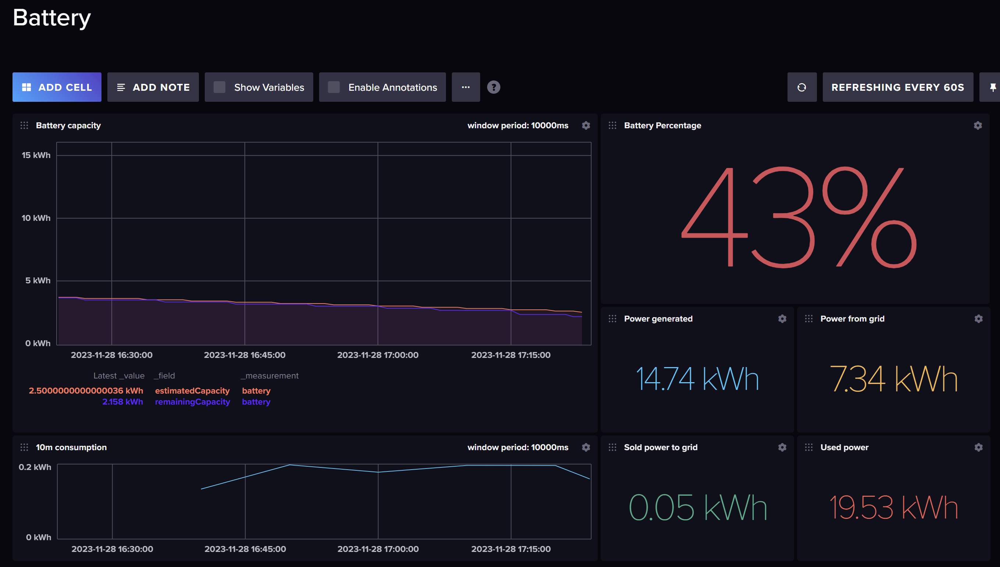

# ニチコンの蓄電池の情報をパナソニックAiSEG2経由で取り出すプログラム

## サンプル画面




## 構成図

```asciiart


    ┌────────┐              ┌─────────┐              ┌───────┐
    │Nichicon│◄─────────────┤Panasonic│◄─────────────┤Node.js│
    │Battery │ ECHONET Lite │AiSEG2   │ Web scraping │program│
    └────────┘              └─────────┘              └─┬─────┘
                                                       │ Write data
                                                       ▼ every 1min.
                                                     ┌────────┐
                                                     │InfluxDB│
                                                     └────────┘
```

## .env ファイルの書き方

```.env
# Panasonic AiSEG2
AISEG2_IP_ADDRESS=AiSEG2のIPアドレス
AISEG2_USERNAME=AiSEG2のログインユーザー名(デフォルトだと空文字)
AISEG2_PASSWORD=AiSEG2のログインパスワード(デフォルトだと製造番号)

# Nichicon battery
BATTERY_CAPACITY=ニチコンの蓄電池の最大容量(kWh)
BATTERY_LOW_LIMIT=蓄電池の放電制限パーセンテージ(デフォルトは30%)

# InfluxDB in Docker Compose
DOCKER_INFLUXDB_INIT_MODE=setup
DOCKER_INFLUXDB_INIT_USERNAME=admin
DOCKER_INFLUXDB_INIT_PASSWORD=password
DOCKER_INFLUXDB_INIT_ORG=my-org
DOCKER_INFLUXDB_INIT_BUCKET=my-bucket

# AiSEG2 to InfluxDB
INFLUXDB_URL=http://influxdb:8086
INFLUXDB_ORG=my-org
INFLUXDB_BUCKET=my-bucket
INFLUXDB_TOKEN=mytoken===
```
